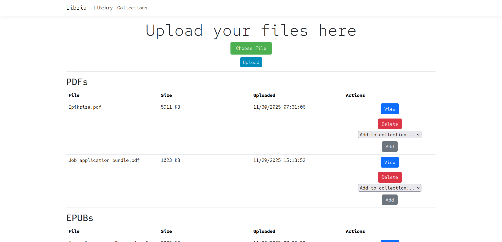
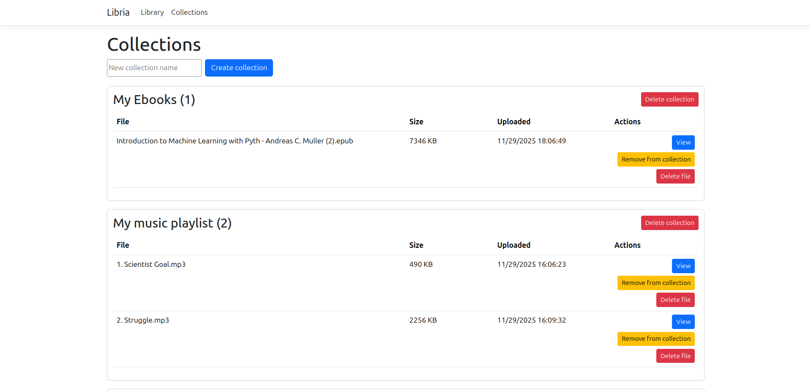
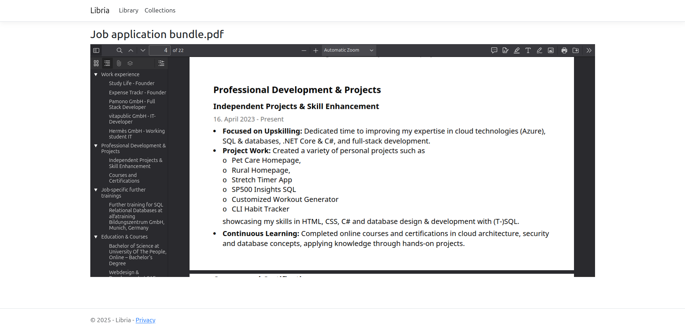
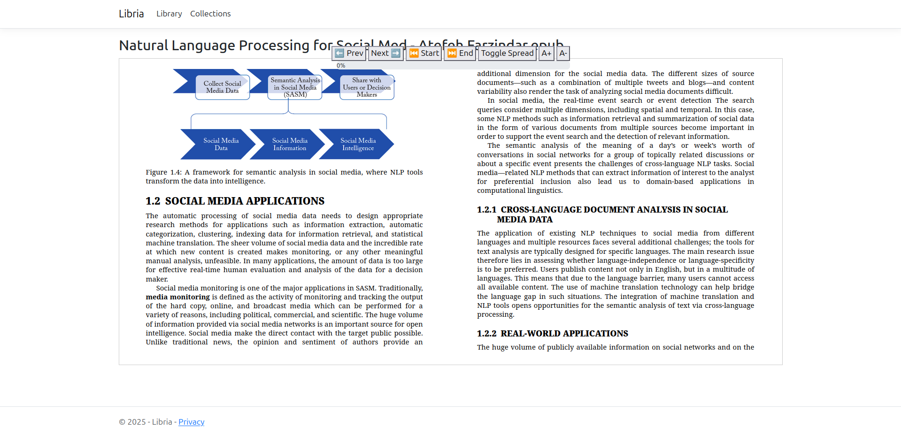
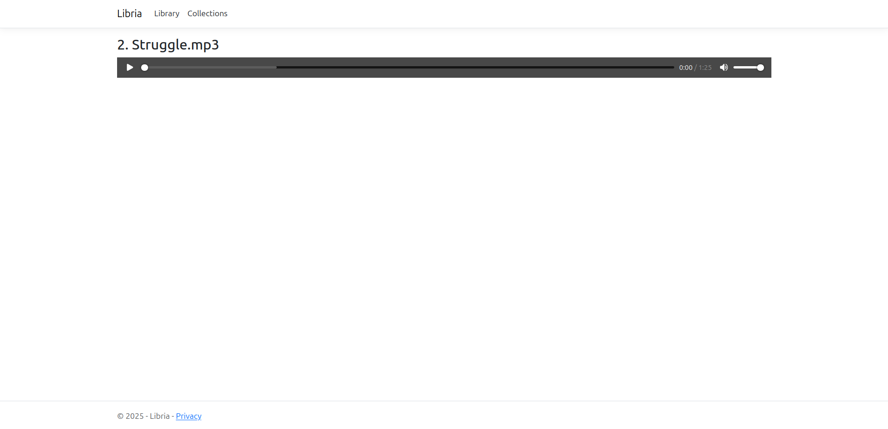

# Project Concept
## “Libria” – A Self-Hosted Digital Library Manager

Written in **C# (.NET 9)** on **Ubuntu**, using **MySQL** as the database, packaged with **Docker**.

It manages:  
- PDF books
- EPUB books
- Images
- Audio files
- Any documents (docx, txt, etc.)

It’s a mix between “self-hosted Google Drive” + “Calibre Web” + “Jellyfin for documents”.

---
# Demo










---

# How to install

1. ``` git clone https://github.com/IcyDrae/Libria.git ```
2. ``` cd Libria/ ```
3. ``` mkdir data ```
4. ``` docker compose -f docker/docker-compose.yml up --build ``` or
5. ``` docker compose -f docker/docker-compose.yml up --build -d ```

---

# Architecture

### Backend (C# / .NET 8)
- ASP.NET Core Web API
- Entity Framework Core → MySQL provider
<!-- - *TODO* Background worker for metadata extraction -->
- Local filesystem storage

### Frontend
- Razor Pages

### Database (MySQL)
- **File**
- **FileMetadata**
- **FileTag**
- **Tag**
- **Collection**

---

# File & Metadata Workflow
1. User uploads a file via UI.
2. File is stored to disk `/data/library/...`
<!-- 3. *TODO* A background service scans it and extracts metadata depending on type:
   - PDF — use `iText7` or `PdfPig`
   - EPUB — use `epublib-core` (C# port exists)
   - Images — use `ImageSharp`
   - Audio — use `TagLibSharp` -->
3. Metadata inserted into MySQL.
4. UI shows library list and categories.

---

### Core Features
- Upload + organize all file types
- Collections, categorize your files in groups
<!-- - Automatic metadata extraction -->
<!-- - Full-text search (title, author, tags, etc.) -->
- Reading/preview mode for PDFs + EPUBs
- Audio streaming for music/podcasts
<!-- - Tag system -->
<!-- - Smart collections (auto-generated lists) -->

---

# Deployment

- `docker-compose.yml` with:
  - app container
  - mysql container

---

# License

GNU GENERAL PUBLIC LICENSE Version 3
